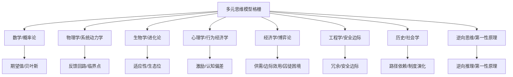

# 查理·芒格思维模型代表模型举例与应用

## 1. 代表性思维模型详细举例

### 1.1 数学与概率论
- **期望值模型**
  - 定义：$E[X] = \sum p_i x_i$
  - 应用：投资决策、风险评估、下注选择
  - 芒格语录：“所有人生决策都应考虑概率和期望值。”
- **贝叶斯推断**
  - 定义：$P(A|B) = \frac{P(B|A)P(A)}{P(B)}$
  - 应用：信息更新、判断修正

### 1.2 物理学与系统动力学
- **反馈回路**
  - 正反馈：雪球效应、复利增长
  - 负反馈：自我调节、市场均衡
- **临界点与非线性**
  - 应用：市场崩盘、系统突变

### 1.3 生物学与进化论
- **适应性模型**
  - 变异、选择、适者生存
  - 应用：企业竞争、个人成长
- **生态位理论**
  - 资源分配、差异化竞争

### 1.4 心理学与行为经济学
- **激励机制**
  - “Show me the incentive and I will show you the outcome.”
  - 应用：企业管理、政策设计
- **认知偏差**
  - 代表：确认偏误、锚定效应、过度自信、损失厌恶
  - 应用：投资陷阱、决策误区

### 1.5 经济学与博弈论
- **供需模型**
  - 市场价格形成、资源配置
- **边际效用**
  - 决策边界、最优分配
- **囚徒困境**
  - 合作与背叛、激励设计

### 1.6 工程学与安全边际
- **冗余设计**
  - 容错、备份、保险
- **安全边际**
  - 投资留有余地，防止极端风险

### 1.7 历史/社会学
- **路径依赖**
  - 历史惯性、技术锁定
- **制度演化**
  - 社会规则、组织变革

### 1.8 逆向思维与第一性原理
- **逆向推理**
  - 反推失败原因，提前规避
- **第一性原理**
  - 拆解本质，重构方案

---

## 2. 跨学科模型组合应用场景

### 2.1 投资决策
- 概率论（期望值）+ 经济学（供需）+ 心理学（认知偏差）+ 工程学（安全边际）
- 案例：
  - 评估投资项目的概率收益与风险（期望值）
  - 判断市场情绪与供需关系
  - 识别自身和市场的认知偏差
  - 设定安全边际，防止极端损失

### 2.2 企业管理
- 激励机制 + 反馈回路 + 路径依赖
- 案例：
  - 设计合理的激励制度，驱动员工行为
  - 通过正反馈促进创新，负反馈纠偏
  - 关注组织历史与文化路径依赖，避免惯性陷阱

### 2.3 个人成长与学习
- 进化论（适应性）+ 逆向思维 + 第一性原理
- 案例：
  - 持续学习、适应变化
  - 逆向思考，主动规避失败路径
  - 拆解问题到本质，重建认知结构

### 2.4 风险控制与决策
- 贝叶斯推断 + 冗余设计 + 认知偏差纠正
- 案例：
  - 动态修正判断，及时更新信息
  - 设计多重备份，防止单点失败
  - 识别并纠正决策中的偏差

---

## 3. 芒格思维模型结构可视化

---

## 4. 总结

- 芒格思维模型强调“跨学科、组合拳”，实际应用需灵活调度多种模型。
- 建议在遇到复杂问题时，主动检索并组合不同领域的模型，提升决策质量。
- 可将本文件作为个人/团队的思维模型参考手册，持续补充完善。 