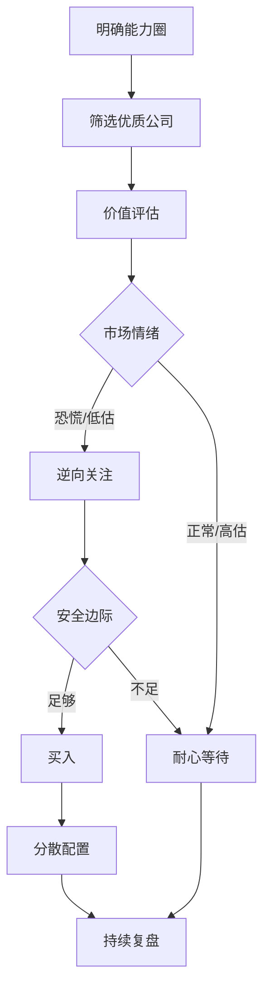
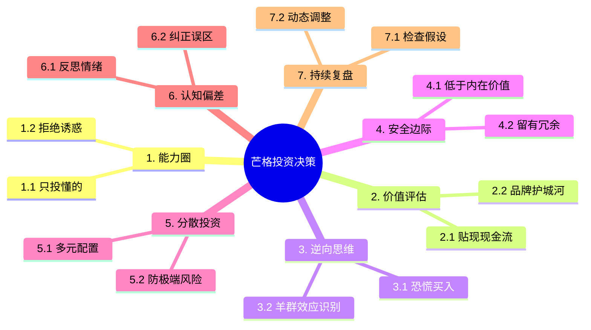

# 查理·芒格思维模型：投资领域深度案例与思维导图

## 1. 投资领域深度案例：逆向投资与安全边际

### 案例背景
1987年股灾后，芒格与巴菲特逆势大举买入优质公司（如可口可乐、富国银行），实现长期高回报。

### 模型应用拆解
- **概率论/期望值**：
  - 量化长期现金流、品牌价值，计算投资的正期望。
- **逆向思维**：
  - 在市场恐慌时，主动与大众观点背离，寻找被低估资产。
- **认知偏差识别**：
  - 识别市场参与者的从众、恐惧、锚定等偏差。
- **安全边际**：
  - 只在价格远低于内在价值时买入，留有足够冗余。
- **能力圈**：
  - 坚持只投资自己理解的行业和公司。

### 操作流程
1. **筛选标的**：聚焦能力圈内的优质公司。
2. **价值评估**：用贴现现金流等方法量化内在价值。
3. **逆向观察**：市场极度悲观时重点关注。
4. **安全边际**：设定买入价必须大幅低于内在价值。
5. **分散投资**：多元配置，防止单一风险。
6. **持续复盘**：定期检视假设与市场变化。

---

## 2. 投资决策流程可视化（Mermaid）

---

## 3. 芒格投资经典语录摘录

> “要想获得非凡的投资回报，你必须在别人恐惧时贪婪。”

> “安全边际是投资的核心，只有在价格远低于价值时才出手。”

> “逆向思维不是反对一切，而是在关键时刻敢于与众不同。”

> “能力圈之外的机会再多，也与你无关。”

> “投资的第一原则是避免愚蠢，第二原则是记住第一原则。”

---

## 4. 投资决策思维导图（Mermaid）

---

## 5. 总结
- 芒格投资思想的核心是跨学科模型组合、逆向思维、安全边际和持续复盘。
- 建议每次投资决策都用上述流程和思维导图自查，提升理性和长期收益。 