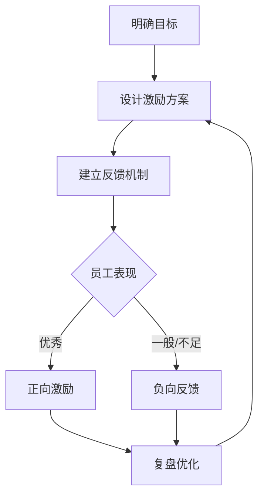
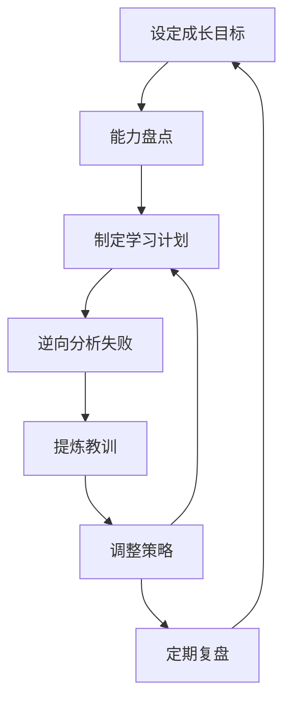
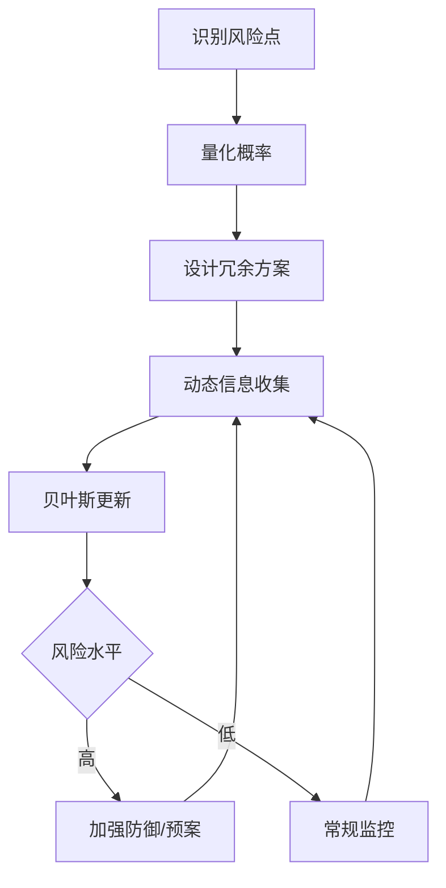
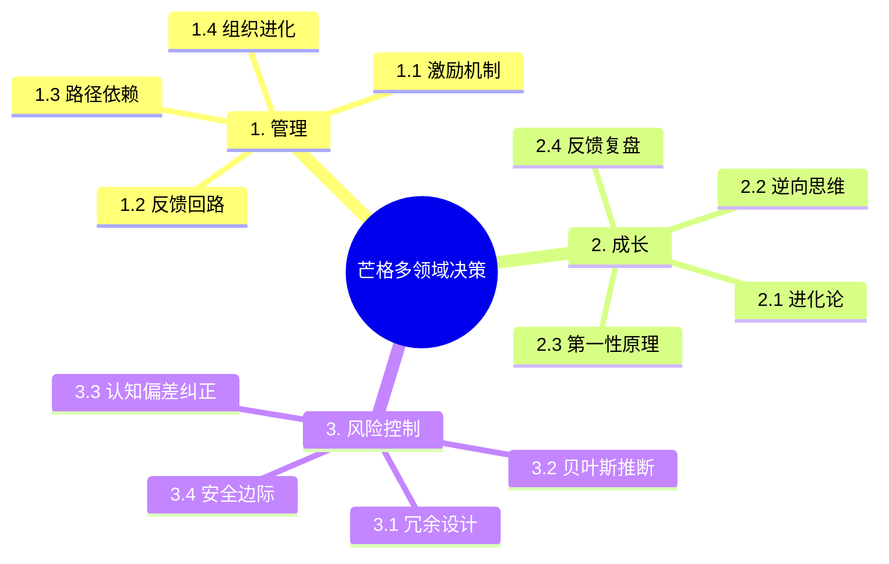

# 查理·芒格思维模型：管理、成长、风险控制领域深度案例与导图

## 1. 管理领域深度案例：激励机制与组织进化

### 案例背景
某科技公司因激励机制单一，员工创新动力不足，业绩增长停滞。新管理层引入多元激励与反馈机制，企业焕发活力。

### 模型应用拆解
- **激励机制**：设计多层次奖励，兼顾短期与长期。
- **反馈回路**：设立月度目标，及时正向反馈，负向纠偏。
- **路径依赖**：识别旧制度惯性，逐步优化。
- **进化论**：鼓励试错，优胜劣汰，持续优化组织结构。

### 操作流程
1. 明确组织目标与核心价值观。
2. 设计多元激励方案（奖金、股权、荣誉等）。
3. 建立正负反馈机制，及时调整。
4. 定期复盘，淘汰无效机制，保留有效创新。

#### 管理决策流程可视化（Mermaid）

---

## 2. 个人成长领域深度案例：终身学习与逆向成长

### 案例背景
一位工程师在职业中期陷入瓶颈，通过跨学科学习和逆向思维，突破自我限制，获得新发展。

### 模型应用拆解
- **进化论/适应性**：主动学习新技能，适应行业变化。
- **逆向思维**：反思失败与不足，寻找成长盲区。
- **第一性原理**：拆解问题本质，重构知识体系。
- **反馈回路**：定期自我评估，调整成长路径。

### 操作流程
1. 设定成长目标，识别能力短板。
2. 制定跨学科学习计划。
3. 逆向分析失败经验，提炼教训。
4. 定期复盘，动态调整学习策略。

#### 个人成长决策流程可视化（Mermaid）

---

## 3. 风险控制领域深度案例：企业多元防御体系

### 案例背景
某制造企业因单一供应链中断，遭遇重大损失。后续引入多元供应、冗余设计和动态风险评估，显著提升抗风险能力。

### 模型应用拆解
- **冗余设计**：多供应商、多渠道备份。
- **贝叶斯推断**：动态评估风险概率，及时调整策略。
- **认知偏差纠正**：防止过度自信和侥幸心理。
- **安全边际**：为极端事件预留缓冲。

### 操作流程
1. 识别关键风险点，量化影响概率。
2. 设计多重冗余与备份方案。
3. 定期收集新信息，贝叶斯更新风险评估。
4. 设立安全边际，制定应急预案。

#### 风险控制决策流程可视化（Mermaid）

---

## 4. 综合思维导图（Mermaid）

---

## 5. 总结
- 芒格思维模型在管理、成长、风险控制等领域同样适用，关键在于跨学科组合、动态调整和持续复盘。
- 建议结合实际场景，灵活选用和组合模型，提升组织与个人的长期竞争力。 